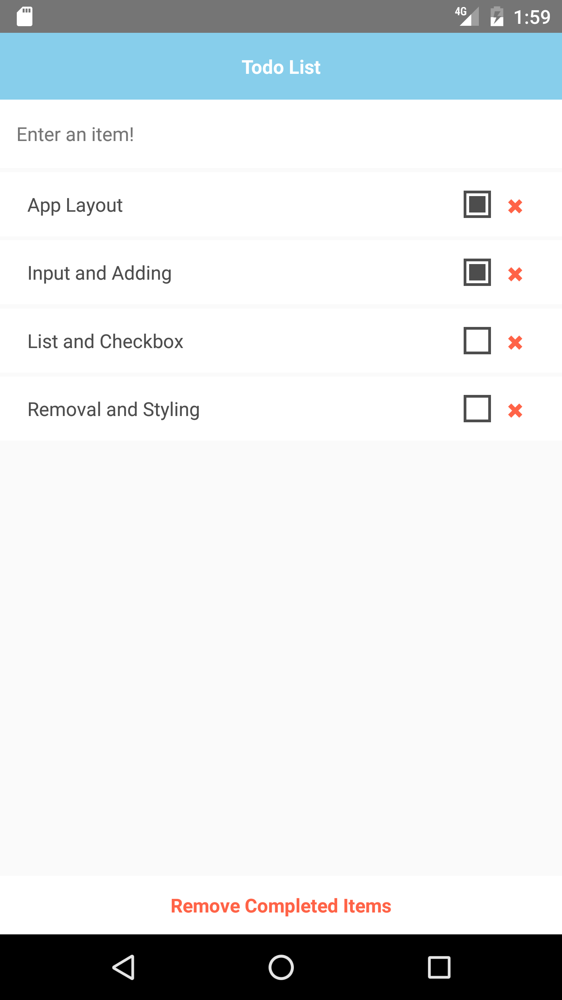

React Native Express Todo Exercise
=========

This is my implementation of the first exercise in the [React Native Express](http://www.reactnativeexpress.com/) Tutorial. A simple todo application built with React Native and using Redux to manage application state.

